# 🧠 NeuralRAG - Self-Correcting Multi-Modal RAG System

[](https://fastapi.tiangolo.com/)
[](https://nextjs.org/)
[](https://www.python.org/)
[](https://www.docker.com/)

A production-ready Retrieval-Augmented Generation (RAG) system with **self-correcting capabilities**, **multi-modal document processing**, and **hybrid search**. Built for accuracy, scalability, and ease of deployment.

## ✨ Key Features

- **🔄 Self-Correcting RAG Pipeline** - Iterative validation and refinement of AI responses for maximum accuracy
- **📚 Multi-Modal Document Processing** - Specialized handlers for legal, financial, technical documents and images
- **🔍 Hybrid Search Engine** - Combines dense vector search (semantic) with BM25 sparse search (keyword)
- **🎯 High Accuracy** - Query rewriting, answer validation, and hallucination detection
- **💬 Streaming Responses** - Real-time answer generation with processing logs
- **🗂️ Collection Isolation** - Organize documents into separate knowledge bases
- **📝 Session Management** - Persistent chat history with SQLite backend
- **🐳 Docker Ready** - One-command deployment with docker-compose
- **🎨 Modern UI** - Beautiful Next.js frontend with glassmorphism design

## 📋 Table of Contents

- [Architecture](#-architecture)
- [Features in Detail](#-features-in-detail)
- [Installation](#-installation)
- [Usage](#-usage)
- [API Reference](#-api-reference)
- [Technical Details](#-technical-details)
- [Development](#-development)
- [Screenshot](#-screenshot)

---

## 🏗 Architecture

### System Overview


### Self-Correcting RAG Pipeline

The core innovation of NeuralRAG is its self-correcting pipeline that iteratively improves answer quality:


### Document Processing Pipeline


### Hybrid Search Architecture


### Collection & Session Architecture

```mermaid
graph TB
    subgraph "User Space"
        User[User]
    end
    
    subgraph "Collections"
        C1[Collection: Legal Docs<br/>doc_count: 5]
        C2[Collection: Financial Q4<br/>doc_count: 3]
        C3[Collection: Default<br/>doc_count: 0]
    end
    
    subgraph "Sessions"
        S1[Session 1<br/>Contract Review<br/>→ Collection: Legal Docs]
        S2[Session 2<br/>Q4 Analysis<br/>→ Collection: Financial Q4]
        S3[Session 3<br/>General Chat<br/>→ Collection: Default]
    end
    
    subgraph "Vector Database"
        V1[(Legal Docs<br/>Vector Space)]
        V2[(Financial Q4<br/>Vector Space)]
        V3[(Default<br/>Vector Space)]
    end
    
    User --> S1 & S2 & S3
    S1 --> C1 --> V1
    S2 --> C2 --> V2
    S3 --> C3 --> V3
    
    style User fill:#a78bfa
    style C1 fill:#60a5fa
    style C2 fill:#60a5fa
    style C3 fill:#60a5fa
```



---

## 🎯 Features in Detail

### 1. Self-Correcting Pipeline

The system validates every answer and iteratively improves it:

- **Query Rewriting**: Expands queries into 3 variations for better retrieval
- **Answer Validation**: Checks factual grounding and confidence scores
- **Hallucination Detection**: Identifies unsupported claims
- **Iterative Refinement**: Re-generates answers with corrective guidance
- **Max 2 Iterations**: Balances accuracy with response time

**Example Workflow**:
```
User: "What's the revenue?"
→ Query Rewriter: ["What is the revenue?", "Show revenue figures", "Revenue performance"]
→ Hybrid Search: Retrieve 10 chunks from all 3 queries
→ Generate Answer: "$5.2M in Q4"
→ Validator: confidence=0.85 ✓
→ Return: High-confidence answer
```

### 2. Multi-Modal Document Processing

**Supported Document Types**:

| Type | Handler | Features | Use Cases |
|------|---------|----------|-----------|
| **Legal** | `LegalHandler` | Semantic chunking, metadata extraction, table-aware | Contracts, agreements, policies |
| **Financial** | `FinancialHandler` | Table parsing, numeric extraction, quarter detection | Earnings reports, balance sheets |
| **Technical** | `TechnicalHandler` | Markdown preservation, code blocks, hierarchical chunking | Manuals, documentation, guides |
| **Images** | `ImageHandler` | Vision LLM analysis, structured extraction | Charts, diagrams, photos |

**Auto-Detection**: The `DocumentRouter` analyzes file content and scores indicators for each type, automatically selecting the best handler.

### 3. Hybrid Search Engine

**Dense Vector Search** (Semantic):
- Model: `all-mpnet-base-v2` (768 dimensions)
- Similarity: Cosine distance
- Strength: Understands meaning and context

**Sparse BM25 Search** (Keyword):
- Algorithm: BM25Okapi
- Tokenization: Word-level
- Strength: Exact matches and rare terms

**Reciprocal Rank Fusion** (RRF):
- Combines rankings from both search methods
- Formula: `score = Σ(1 / (k + rank))` where k=60
- Results in better overall relevance

### 4. Session & Collection Management

- **Collections**: Isolated document groups (e.g., "Q4 Financials", "Legal Contracts")
- **Sessions**: Chat threads linked to collections
- **Persistence**: SQLite database stores all history
- **Cleanup**: Deleting a session removes its documents (if no other sessions use them)

---

## 🚀 Installation

### Prerequisites

- **Docker** (recommended) or Python 3.9+
- **Ollama** (for local LLM) or Docker
- 8GB+ RAM recommended

### Option 1: Docker Deployment (Recommended)

**Step 1**: Clone the repository
```bash
git clone <repository-url>
cd RAG_Project
```

**Step 2**: Configure environment (optional)
```bash
cp .env.example .env
# Edit .env to customize models and paths
```

**Step 3**: Start the stack
```bash
docker-compose up -d
```

This will:
- Pull Ollama image and download `llama3` and `llava` models
- Build and start the backend (FastAPI)
- Build and start the frontend (Next.js)
- Create persistent volumes for data and models

**Step 4**: Access the application
- **Frontend**: http://localhost:3000
- **Backend API**: http://localhost:8000
- **API Docs**: http://localhost:8000/docs
- **Ollama**: http://localhost:11434

**Step 5**: Verify deployment
```bash
# Check health status
curl http://localhost:8000/health

# Expected response:
{
  "status": "healthy",
  "ollama": "connected",
  "database": "connected (0 docs)",
  "system": "NeuralRAG v2.0"
}
```

### Option 2: Local Development

**Step 1**: Install Ollama
```bash
# Download from https://ollama.ai
# Pull required models
ollama pull llama3
ollama pull llava
```

**Step 2**: Set up Python backend
```bash
# Create virtual environment
python -m venv venv
source venv/bin/activate  # On Windows: venv\Scripts\activate

# Install dependencies
pip install -r requirements.txt

# Start backend
uvicorn main:app --reload --port 8000
```

**Step 3**: Set up Next.js frontend
```bash
cd rag-frontend
npm install
npm run dev
```

**Step 4**: Configure environment
Create `.env` in project root:
```bash
RAG_LLM_MODEL=llama3
RAG_VISION_MODEL=llava
RAG_EMBED_MODEL=all-mpnet-base-v2
OLLAMA_HOST=http://localhost:11434
```

---

## 📖 Usage

### Web Interface

**1. Create a Collection** (optional)
   - Click "New Collection" in sidebar
   - Name: "Q4 Financial Reports"
   - Description: "Earnings and balance sheets for Q4 2024"

**2. Upload Documents**
   - Select collection from dropdown
   - Click upload button or drag-and-drop
   - Supported formats: PDF, TXT, MD, DOC, DOCX, PNG, JPG

**3. Start a Chat Session**
   - Click "New Chat" button
   - Select the collection to chat with
   - System creates isolated session

**4. Ask Questions**
   - Type your question
   - Watch real-time processing logs (query rewriting, search, validation)
   - Receive answer with confidence score and sources

**5. View Processing Logs**
   - Toggle "Show Logs" to see self-correction pipeline
   - See query variations, search results, validation scores

### API Usage

#### Upload a Document

```bash
curl -X POST "http://localhost:8000/upload?collection_id=default" \
  -F "file=@document.pdf"
```

**Response**:
```json
{
  "status": "success",
  "message": "Indexed 45 chunks from document.pdf",
  "document_type": "financial",
  "handler": "FinancialHandler",
  "collection_id": "default",
  "chunks_created": 45
}
```

#### Chat (Non-Streaming)

```bash
curl -X POST "http://localhost:8000/chat" \
  -H "Content-Type: application/json" \
  -d '{
    "query": "What was the Q4 revenue?",
    "collection_id": "default",
    "use_self_correction": true
  }'
```

**Response**:
```json
{
  "response": "The Q4 revenue was $5.2 million, representing a 15% increase...",
  "context_used": ["Source 1 excerpt...", "Source 2 excerpt..."],
  "confidence": 0.87,
  "iterations": 1,
  "was_corrected": false
}
```

#### Chat (Streaming)

```bash
curl -X POST "http://localhost:8000/chat/stream" \
  -H "Content-Type: application/json" \
  -d '{
    "query": "Summarize the contract terms",
    "collection_id": "legal-docs"
  }'
```

**NDJSON Stream**:
```json
{"type": "log", "step": "query_rewriting", "message": "Generated 3 query variations"}
{"type": "log", "step": "search", "message": "Retrieved 12 candidates"}
{"type": "token", "content": "The contract "}
{"type": "token", "content": "specifies a "}
{"type": "token", "content": "term of 24 months..."}
{"type": "done", "confidence": 0.92, "sources": ["contract.pdf:page=2"]}
```

---

## 📚 API Reference

### Document Management

| Endpoint | Method | Description |
|----------|--------|-------------|
| `/upload` | POST | Upload and index a document |
| `/documents` | DELETE | Delete all documents (requires confirmation) |

### Chat Endpoints

| Endpoint | Method | Description |
|----------|--------|-------------|
| `/chat` | POST | Standard chat (non-streaming) |
| `/chat/stream` | POST | Streaming chat with logs |
| `/chat/history/{session_id}` | GET | Get chat history for session |
| `/chat/history/{session_id}` | DELETE | Clear chat history |

### Collection Management

| Endpoint | Method | Description |
|----------|--------|-------------|
| `/collections` | GET | List all collections |
| `/collections` | POST | Create new collection |
| `/collections/{id}` | DELETE | Delete collection and documents |

### Session Management

| Endpoint | Method | Description |
|----------|--------|-------------|
| `/sessions` | GET | List all sessions |
| `/sessions` | POST | Create new session |
| `/sessions/{id}` | GET | Get session details and messages |
| `/sessions/{id}` | PATCH | Update session name |
| `/sessions/{id}` | DELETE | Delete session and cleanup resources |
| `/sessions/{id}/messages` | POST | Add message to session |

### System

| Endpoint | Method | Description |
|----------|--------|-------------|
| `/health` | GET | Health check (Ollama, database) |
| `/stats` | GET | System statistics |
| `/` | GET | API info |

**Complete API documentation**: http://localhost:8000/docs

---

## 🔧 Technical Details

### Project Structure

```
RAG_Project/
├── main.py                 # FastAPI application entry point
├── config.py              # Centralized configuration
├── database.py            # VectorDB with hybrid search
├── collection_manager.py  # Collection isolation logic
├── requirements.txt       # Python dependencies
├── Dockerfile            # Backend container
├── docker-compose.yml    # Full stack orchestration
│
├── handlers/             # Document processing
│   ├── router.py         # Auto-detection and routing
│   ├── legal.py          # Legal document handler
│   ├── financial.py      # Financial document handler
│   ├── technical.py      # Technical document handler
│   └── image.py          # Image vision handler
│
├── self_correction/      # Self-correcting pipeline
│   ├── pipeline.py       # Main RAG pipeline
│   ├── validator.py      # Answer validation
│   └── query_rewriter.py # Query expansion
│
├── search/              # Search components
│   └── reranker.py      # Cross-encoder reranking
│
├── memory/              # Session management
│   └── session_store.py # SQLite session storage
│
├── multimodal/          # Multi-modal support
│   └── vision.py        # Image analysis with LLaVA
│
├── utils/               # Utilities
│   ├── logger.py        # Structured logging
│   └── auth.py          # Authentication helpers
│
└── rag-frontend/        # Next.js frontend
    ├── app/
    │   ├── page.tsx     # Main chat interface
    │   └── components/  # React components
    ├── Dockerfile       # Frontend container
    └── package.json     # Node dependencies
```

### Core Components

#### 1. VectorDB (`database.py`)

**Features**:
- Parent-child chunking strategy
- Hybrid search (BM25 + Dense)
- Reciprocal rank fusion
- Collection-based isolation
- Persistent storage (ChromaDB + JSON)

**Key Methods**:
- `add_documents()`: Index with parent-child chunking
- `retrieve()`: Hybrid search with RRF
- `delete_by_collection()`: Cleanup by collection

#### 2. SelfCorrectingRAG (`self_correction/pipeline.py`)

**Workflow**:
1. Query rewriting (3 variations)
2. Hybrid search for all variations
3. Cross-encoder reranking
4. LLM answer generation
5. Answer validation (factual grounding check)
6. If low confidence: hallucination correction or search expansion
7. Max 2 iterations

**Validation Criteria**:
- Factual grounding in context
- Confidence threshold: 0.6
- Hallucination detection via claim extraction

#### 3. DocumentRouter (`handlers/router.py`)

**Detection Algorithm**:
```python
# Image detection: file extension
if ext in ['.png', '.jpg', '.jpeg']: return 'image'

# Content analysis for PDFs
text = extract_first_3000_chars(pdf)
scores = {
    'legal': count_legal_terms(text),
    'financial': count_financial_terms(text) + numeric_density(text),
    'technical': count_technical_terms(text) + code_patterns(text)
}
return max(scores)
```

#### 4. Session Management (`memory/session_store.py`)

**Schema** (SQLite):
```sql
CREATE TABLE sessions (
    id TEXT PRIMARY KEY,
    name TEXT,
    collection_id TEXT,
    created_at TIMESTAMP
);

CREATE TABLE messages (
    id TEXT PRIMARY KEY,
    session_id TEXT,
    role TEXT,  -- 'user' or 'assistant'
    content TEXT,
    confidence REAL,
    sources TEXT,  -- JSON array
    timestamp TIMESTAMP
);
```

### Configuration

Environment variables (`.env`):

```bash
# Models
RAG_LLM_MODEL=llama3           # Chat model
RAG_VISION_MODEL=llava         # Image analysis
RAG_EMBED_MODEL=all-mpnet-base-v2  # Embeddings

# Storage
RAG_DATA_DIR=data              # Upload directory
RAG_CHROMA_DIR=chroma_db       # Vector database

# Chunking
RAG_CHUNK_SIZE=1000            # Parent chunk size
RAG_CHUNK_OVERLAP=100          # Overlap size

# Ollama (Docker)
OLLAMA_HOST=http://ollama:11434  # Container name
```

### Performance Considerations

**Embedding Model**:
- `all-mpnet-base-v2`: 768 dimensions, best quality
- Alternative: `all-MiniLM-L6-v2` (384 dim, faster)

**Chunking Strategy**:
- Parent chunks: ~1000 chars (semantic units)
- Child chunks: 200 words sliding window
- Retrieval on children, return parents for full context

**Search Parameters**:
- Initial retrieval: top-20 per query variation
- After RRF: top-10 combined
- After reranking: top-5 final

**Self-Correction**:
- Max iterations: 2
- Confidence threshold: 0.6
- Timeout: ~10-15 seconds for full pipeline

---

## 💻 Development

### Running Tests

```bash
# Backend unit tests (if available)
pytest tests/

# Check API health
curl http://localhost:8000/health
```

### Development Workflow

**Backend Changes**:
```bash
# Auto-reload enabled by default
uvicorn main:app --reload --port 8000
```

**Frontend Changes**:
```bash
cd rag-frontend
npm run dev  # Hot reload enabled
```

### Adding a New Document Handler

1. Create `handlers/custom.py`:
```python
from .base import BaseHandler

class CustomHandler(BaseHandler):
    def get_type_name(self) -> str:
        return "custom"
    
    def ingest(self, file_path: str) -> str:
        # Extract text
        pass
    
    def chunk(self, text: str):
        # Return list of dicts with 'text' and 'metadata'
        pass
```

2. Register in `handlers/router.py`:
```python
from .custom import CustomHandler

self.handlers['custom'] = CustomHandler()
```

3. Add detection logic in `classify()` method

### Customizing the LLM

**Switch to GPT-4** (requires API key):
```python
# In self_correction/pipeline.py, replace ollama.chat() with:
import openai
response = openai.ChatCompletion.create(
    model="gpt-4",
    messages=[{"role": "user", "content": prompt}]
)
```

**Use Llama 3.1** (larger model):
```bash
# Pull model
docker exec neuralrag-ollama ollama pull llama3.1

# Update .env
RAG_LLM_MODEL=llama3.1
```

### Database Management

**View database stats**:
```bash
curl http://localhost:8000/stats
```

**Backup vector database**:
```bash
# Copy chroma_db directory
docker cp neuralrag-backend:/app/chroma_db ./backup/

# For local: simply copy the directory
cp -r chroma_db backup/
```

**Reset database**:
```bash
# Stop containers
docker-compose down

# Remove volumes
docker volume rm neuralrag-chroma neuralrag-uploads

# Restart
docker-compose up -d
```

---

## 📸 Screenshot

### Main Interface


## 🤝 Contributing

Contributions welcome! Please:
1. Fork the repository
2. Create a feature branch (`git checkout -b feature/amazing`)
3. Commit changes (`git commit -m 'Add amazing feature'`)
4. Push to branch (`git push origin feature/amazing`)
5. Open a Pull Request

---

## 📄 License

This project is licensed under the **MIT License**.

```
MIT License

Copyright (c) 2024

Permission is hereby granted, free of charge, to any person obtaining a copy
of this software and associated documentation files (the "Software"), to deal
in the Software without restriction, including without limitation the rights
to use, copy, modify, merge, publish, distribute, sublicense, and/or sell
copies of the Software, and to permit persons to whom the Software is
furnished to do so, subject to the following conditions:

The above copyright notice and this permission notice shall be included in all
copies or substantial portions of the Software.

THE SOFTWARE IS PROVIDED "AS IS", WITHOUT WARRANTY OF ANY KIND, EXPRESS OR
IMPLIED, INCLUDING BUT NOT LIMITED TO THE WARRANTIES OF MERCHANTABILITY,
FITNESS FOR A PARTICULAR PURPOSE AND NONINFRINGEMENT. IN NO EVENT SHALL THE
AUTHORS OR COPYRIGHT HOLDERS BE LIABLE FOR ANY CLAIM, DAMAGES OR OTHER
LIABILITY, WHETHER IN AN ACTION OF CONTRACT, TORT OR OTHERWISE, ARISING FROM,
OUT OF OR IN CONNECTION WITH THE SOFTWARE OR THE USE OR OTHER DEALINGS IN THE
SOFTWARE.
```

---

## 🙏 Acknowledgments

- **Ollama** for local LLM hosting
- **ChromaDB** for vector database
- **Sentence Transformers** for embeddings
- **Next.js** and **FastAPI** teams

---

## 📞 Support

For issues and questions:
- Open an issue on GitHub
- Check `/docs` endpoint for API documentation
- Review logs in Docker: `docker logs neuralrag-backend`

---

**Built for accurate, reliable AI-powered document Q&A**
